# Repository Guidelines

## Project Overview

kcptun is a userspace tunnel: a local TCP/UNIX listener is multiplexed (smux) over an encrypted, FEC-protected KCP/UDP session to a server that dials the real target.

Module: `github.com/xtaci/kcptun`. Go 1.27. Licensed MIT (Copyright xtaci, 2016). There is no Makefile, no `go.work`, no GitHub Actions, no `vendor/`, and no root CONTRIBUTING.md.

Library internals live under `staging/` and already have their own guides — read those instead of duplicating them here:

- [`staging/kcp-go/AGENTS.md`](staging/kcp-go/AGENTS.md) — ARQ state machine, `UDPSession`, FEC, platform I/O
- [`staging/smux/AGENTS.md`](staging/smux/AGENTS.md) — mux wire format, four session goroutines, v1/v2 flow control

## Architecture & Data Flow

Layer stack, outermost to UDP:

```
TCP/UNIX app
  -> client listener (:12948)
  -> smux.Stream / smux.Session
  -> CompStream (LZ4, unless -nocomp)
  -> kcp.UDPSession (cipher + FEC + ARQ)
  -> UDP (:29900)
  -> server AcceptKCP
  -> CompStream -> smux.Server -> AcceptStream
  -> net.DialTimeout(tcp | unix | SOCKS5)
  -> std.Pipe -> target
```



```mermaid
flowchart LR
  App["TCP/UNIX app"] --> Client["client listener"]
  Client -->|"OpenStream"| SmuxC["smux.Session"]
  SmuxC --> CompC["CompStream LZ4"]
  CompC --> KcpC["UDPSession"]
  KcpC -->|"UDP"| KcpS["server AcceptKCP"]
  KcpS --> CompS["CompStream LZ4"]
  CompS --> SmuxS["smux.Server"]
  SmuxS -->|"AcceptStream"| Dial["dial target"]
  Dial --> Target["TCP/UNIX/SOCKS5"]
```

**Client** (`client/main.go`): one blocking `Accept` loop. `-conn N` pre-creates smux sessions in `muxes []timedSession`; round-robin pick, with per-slot background `ensureSession` guarded by `refreshInflight` + `muxMu`. A dead slot refreshes in the background and **drops the client** rather than blocking accept. `handleClient` does `session.OpenStream()` then `std.Pipe`. `waitConn` retries `createConn` every 1s. `scavenger` (tick `scavengePeriod = 5s`) closes sessions past `expiryDate` when `-autoexpire > 0`.

**Server** (`server/main.go`): `std.ParseMultiPort(config.Listen)` then one `kcp.ListenWithOptions` **per port** (`:3000-4000` = 1001 UDP sockets). Each `serveListener` is tracked by `sync.WaitGroup`. Per accepted KCP conn: `SetStreamMode(true)`, `SetWriteDelay(false)`, `SetNoDelay`/`SetMtu`/`SetWindowSize`/`SetACKNoDelay`/`SetRateLimit`, then `go handleMux`. `handleMux` runs `smux.Server` + `AcceptStream` and dials the target (10s timeout) into `std.Pipe`.

**Where each concern lives:**

| Concern | Owner |
|---|---|
| ARQ, FEC, cipher, UDP I/O | `staging/kcp-go` (`UDPSession`) |
| Stream mux, keepalive, HOLB buffers | `staging/smux` |
| LZ4, copy/pipe, crypt name map, JSON, SNMP CSV, SOCKS5, multiport | `std/` |
| CLI, session pool, transparent proxy | `client/` |
| CLI, per-port listeners, target dial (TCP/UNIX/SOCKS5) | `server/` |

Compression sits **below** smux on both sides (`createConn` / `serveListener`). Moving it above smux silently breaks the tunnel. `-nocomp` must match on both peers.

Key types: `client.Config` / `server.Config` (both embed `std.BaseConfig`), `kcp.BlockCrypt`, `*kcp.UDPSession`, `*smux.Session`, `*smux.Stream`, `std.CompStream`, `std.MultiPort`, `shmmap.Store`, `timedSession`.

## Key Directories

| Path | Role |
|---|---|
| `client/` | Client binary (`package main`). Listen TCP/UNIX, dial KCP, multiplex streams. |
| `server/` | Server binary (`package main`). Listen UDP/KCP, accept smux, dial target. |
| `std/` | Shared helpers used by **both** binaries. Touching `BaseConfig`, `Pipe`, `SelectBlockCrypt`, `BuildSmuxConfig`, `ParseMultiPort`, or `SnmpLogger` affects both. |
| `std/shmmap/` | Linux POSIX shm IP→domain store for transparent proxy. Cross-process ABI. |
| `staging/kcp-go/` | In-tree `github.com/xtaci/kcp-go/v5` (own `go.mod`). |
| `staging/smux/` | In-tree `github.com/xtaci/smux` (own `go.mod`, zero deps). |
| `dist/` | JSON examples, systemd units, sysctl, Debian/RPM/FreeBSD packaging. |
| `build/` | Gitignored release output. |

Root `go.mod` mounts the libraries from disk:

```
replace github.com/xtaci/kcp-go/v5 => ./staging/kcp-go/
replace github.com/xtaci/smux       => ./staging/smux/
```

Edits under `staging/` are live for `./client` and `./server` with no `go get`. The required versions (`v5.0.0`, `v0.0.0`) are placeholders — only the replace target matters. Nested `go.mod` files mean **root `go test ./...` does not enter staging**.

## Development Commands

```bash
# Dev binaries (no vendor/ required)
go build -o bin/client ./client
go build -o bin/server ./server

# Root-module tests only (client, server, std) — seconds
go test ./...
go vet ./...

# Staging libraries are separate modules
cd staging/kcp-go && go test ./...     # minutes; multi-GB transfers
cd staging/smux && go test ./...       # minutes; 8 GiB transfers

# Fast staging subsets (skip giant echo tests)
cd staging/kcp-go && go test -run 'TestRing|TestBufferPool|TestFEC|TestCryptErrors|TestRecvBuf' ./
cd staging/smux && go test -run 'TestAlloc|TestBufferRing|TestShaper|TestHalfClose|TestConfig' ./

# Smoke tunnel (both sides MUST pass -key; default key is fatal)
./bin/server -l ":29900" -t 127.0.0.1:8388 -key SECRET -mode fast3 -nocomp
./bin/client -l ":8388"  -r "127.0.0.1:29900" -key SECRET -mode fast3 -nocomp

# JSON configs
./bin/server -c dist/server.json.example
./bin/client -c dist/local.json.example
```

Release scripts write `build/` (`VERSION=$(date -u +%Y%m%d)`, strip with `-s -w`):

| Script | Matrix | CGO | Notes |
|---|---|---|---|
| `./build.sh` | linux/amd64; linux,darwin/arm64 | 0 | Works. `-pgo=auto`. Random `-X main.SALT`. |
| `./build-release.sh` | 15 OS/ARCH | 0 | Official path. **Needs `go mod vendor` first** (`-mod=vendor`, no `vendor/` in tree). Optional UPX. |
| `./build-release-cgo.sh` | same 15 | 1 | External linker only — this repo has no `import "C"`. |

`download.sh` fetches the latest GitHub release tarball for the host OS/ARCH. It does not verify `SHA1SUMS`.

Docker image (`Dockerfile`) is multi-stage (`golang:1.27.0-alpine3.24` → `alpine:3.18` + iptables). No `ENTRYPOINT`/`CMD` — first arg must be `client` or `server`. `EXPOSE 29900/udp` and `12948`. Same `-mod=vendor` trap as the release scripts.

## Code Conventions & Common Patterns

### Config: flags then JSON merge

Both binaries use `github.com/urfave/cli` v1. Flow: allocate `Config{}` → copy every CLI flag → if `-c file.json`, `json.Decode` **overwrites only keys present in the file**. JSON does not replace the whole struct. `SmuxConfig` is `json:"-"` and is built after `ApplyMode()` via `std.BuildSmuxConfig`.

`-mode` presets (`std.PredefinedModes`) overwrite `NoDelay`/`Interval`/`Resend`/`NoCongestion`:

```
normal: {0, 40, 2, 1}
fast:   {0, 30, 2, 1}
fast2:  {1, 20, 2, 1}
fast3:  {1, 10, 2, 1}
```

Unknown mode names (including `manual`) leave the hidden flags (`-nodelay -interval -resend -nc`, `Hidden: true`) intact. That is how `-mode manual -nodelay 1 -interval 20 -resend 2 -nc 1` works.

**JSON-only fields (no CLI flag):**

- client: `conntrack` (Linux `SO_ORIGINAL_DST` transparent proxy), `shmmap` (shm segment name)
- server: `proxy-mode` — `0` auto (UNIX if `target` is not `host:port`, else TCP), `1` `TGT_TCP`, `2` `TGT_SOCKS5`. `TGT_UNIX` is also `0`, so unset and UNIX are indistinguishable until auto-detect runs.

**Must match on both peers or the tunnel fails:** `--key`, `--crypt`, `--nocomp`, `--smuxver`. FEC shards need not match (receiver auto-tunes). PBKDF2 is `pbkdf2.Key(key, SALT, 600000, 32, sha256.New)` with default `SALT = "kcp-go"` (overridable via `-X main.SALT=`). Pair client/server from the **same build** — `build.sh` injects a random salt; `build-release.sh` does not.

Startup rejects the literal default key `it's a secrect`. README QuickStart examples that omit `-key` will not run.

### Errors, logging, concurrency

- `github.com/pkg/errors` (`Wrap`, `Errorf`, `%+v` stacks) in `client/` and `std/multiport.go`. `std/shmmap` uses `fmt.Errorf` + `%w`. Match the file you edit.
- Stdlib `log` only. `log.Lshortfile` is on when `VERSION == "SELFBUILD"`. `-quiet` gates stream open/close via a local `logln` closure. `github.com/fatih/color` is used once (client scavenger warning).
- `checkError(err)` logs `%+v` and `os.Exit(-1)`.
- Channel-as-signal + `sync.Once` for one-shot closes. `sync.Pool` for copy/SOCKS buffers. `multiPortOnce` parses the address once. Non-blocking send to the scavenger channel keeps accept responsive.
- No DI. Free functions on concrete types; seams are `net.Conn` / `io.ReadWriteCloser` / `closeWriter`.

### Platform files

Always edit the real file **and** its stub, or `!linux` builds break:

| Feature | Linux | Other |
|---|---|---|
| `SO_ORIGINAL_DST` | `client/origdst_linux.go` | `client/origdst_stub.go` (error) |
| shmmap | `std/shmmap/shmmap_linux.go` | `std/shmmap/shmmap_stub.go` (no-op + error) |
| SIGUSR1 SNMP / SIGTERM | `std/signal.go` (`linux \|\| darwin \|\| freebsd`) | no stub — `init()` simply does not exist |

`std/signal.go` `init()` installs a handler that `os.Exit(0)` on SIGTERM/SIGINT and dumps `kcp.DefaultSnmp` on SIGUSR1. Importing `std` on those platforms has this side effect.

kcp-go uses the same `//go:build linux` / `!linux` split for `readloop*` / `tx*` / `platform*`, plus a `debug` tag (`kcp_trace_on.go` / `kcp_trace_off.go`).

### Hot paths — do not break

1. **`std.Pipe`** — two copy goroutines, `CloseWrite()` half-close, `errSig` (`sync.Once`) cuts `closeWait` short. Removing the `closeWriter` check breaks non-half-closeable conns.
2. **`std.Copy` order** — `io.WriterTo` (smux `Stream`) then `io.ReaderFrom` then pooled 32KB `io.CopyBuffer`. Reordering allocates per stream.
3. **`CompStream`** — LZ4 64KB blocks; flush when `len(p) < 1024` (SSH/interactive); flush before `CloseWrite`.
4. **KCP tune order** before smux wrap: `SetStreamMode(true)`, `SetWriteDelay(false)`, `SetNoDelay`, `SetWindowSize`, `SetMtu`. Server applies `SetReadBuffer`/`SetWriteBuffer` on the **listener**, not the accepted session (kcp-go: session-level sockbuf is a no-op after `AcceptKCP`).
5. **`SelectBlockCrypt`** — 11 names only (`sm4`, `tea`, `aes-128`, `aes-192`, `blowfish`, `twofish`, `cast5`, `3des`, `xtea`, `salsa20`, `aes-128-gcm`). Unknown names **silently become `aes-128-gcm`**. README's `none` / `null` / `xor` are not wired; `kcp.NewNoneBlockCrypt` exists in staging but is unreachable from the CLI.
6. **FEC** — `DataShard`/`ParityShard` pass straight into `DialWithOptions`/`ListenWithOptions`. Either `<= 0` disables the codec on that side.
7. **`shmmap` layout** is a cross-process ABI (`magic`/`version`/`headerSize`/`slotSize`/seqlock). Do not change `layout.go` without a version bump.
8. **Transparent proxy passthrough** — loopback-on-error and orig==local must stay, or direct connections get an unanswerable SOCKS5 handshake (15s deadline).
9. For kcp-go / smux: never add I/O to `KCP`; always hold `UDPSession.mu` around KCP state; touch both platform I/O branches; recycle pool buffers; keep smux v1 and v2 paths in sync. Details in the staging guides.

## Important Files

| File | Role |
|---|---|
| `client/main.go` | Flags, PBKDF2, accept loop, session pool, scavenger, transparent proxy |
| `client/dial.go` | Multiport parse (`sync.Once`) + random port + `kcp.DialWithOptions` |
| `client/config.go` | Client `Config` embedding `std.BaseConfig` |
| `server/main.go` | Per-port listeners, `serveListener`, `handleMux`, target dial |
| `server/config.go` | Server `Config` (`listen`, `target`, `proxy-mode`) |
| `std/config.go` | `BaseConfig`, `PredefinedModes`, `ApplyMode`, `ParseJSONConfig` |
| `std/copy.go` | `Copy`, `Pipe` |
| `std/crypt.go` | Cipher name → `kcp.BlockCrypt` |
| `std/comp.go` | LZ4 `CompStream` |
| `std/smuxcfg.go` | `BuildSmuxConfig` (`KeepAliveTimeout = 2 * interval`) |
| `std/multiport.go` | `host:min-max` parser |
| `std/proxy.go` | SOCKS5 RFC 1928 (untested) |
| `std/snmp.go` | CSV SNMP logger over `kcp.DefaultSnmp` |
| `std/signal.go` | SIGUSR1 / SIGTERM handler via `init()` |
| `dist/local.json.example`, `dist/server.json.example` | Canonical JSON |
| `dist/linux/sysctl_linux` | UDP `rmem`/`wmem` 25 MiB, `netdev_max_backlog=2048` |
| `dist/linux/kcptun-*.service` | systemd: `GOGC=20`, `LimitNOFILE=65536`, `-c /etc/kcptun-*.json` |

## Runtime/Tooling Preferences

- **Runtime:** Go 1.27.0 at the root. Nested baselines differ (`staging/kcp-go` 1.24, `staging/smux` 1.18) — do not bump those casually. No Node/Bun/npm.
- **CGO:** not used. `CGO_ENABLED=0` everywhere except `build-release-cgo.sh` (static/external linking for RPM). Platform work is build tags, not cgo.
- **No formatter/linter config.** `gofmt`/`go vet` locally. Root `.travis.yml` is GOPATH-era goveralls + `exit 0` — **non-gating**. Staging Travis files run real `go test` but target ancient Go.
- **PGO:** `build.sh` uses `-pgo=auto`. Official release scripts do not.
- **Recommended host:** linux/freebsd, amd64 with AES-NI. Slow ARM: `--datashard 0 --parityshard 0 --crypt salsa20`. Raise `ulimit -n 65535` and apply `dist/linux/sysctl_linux`.
- **pprof:** `--pprof` serves `:6060`. Staging tests also bind `:6060` in `init()` — do not run both suites concurrently on one machine.

Default ports: client TCP `:12948`, server UDP `:29900`. Default cipher is `aes-128-gcm` (AEAD). Default mode is `fast`. Default smux version is 2. `closewait` defaults differ on purpose (client 0, server 5).

## Testing & QA

Three modules, three invocations. All tests are stdlib `testing` (testify only in `staging/kcp-go/autotune_test.go`). No `TestMain`, no fuzz, no `testing.Short()`, no `t.Parallel()`, no golden/`testdata/`. White-box throughout (`package kcp` / `package smux` / `package std` / `package main`).

**Root module** — ~32 fast unit tests. Style: table-driven `t.Run`, `t.TempDir()`, `t.Helper()`. Copy `std/config_test.go` (`TestBaseConfigApplyMode`) and `std/multiport_test.go`. Platform tests use `//go:build linux` (`origdst_linux_test.go`, `shmmap_linux_test.go`); stubs are untested.

**staging/kcp-go** — socket-level integration. Harness in `sess_test.go`: `nextPort()`, `dialEcho`/`listenEcho`/`echoServer`/`handleEcho`, `lossyconn` for loss. Giant tests: `Test1GBEcho`, `Test6GBEcho`. `-short` is a no-op. `nextPort()` collides if two `go test` processes share a host.

**staging/smux** — TCP echo harness: `setupServer`/`setupServerV2` (`testing.TB` so benches reuse it), `newUnitTestStream()` for zero-I/O state. Always cover **v1 and v2**. Giant tests: `Test8GBTransferV1/V2`. `TestConcurrentWriteSameStream` is meant to run with `-race`.

```bash
go test ./...                                      # root only
go test -race ./...                                # root is race-friendly
go test -run TestParseMultiPort ./std/
cd staging/kcp-go && go test -tags debug -run ^TestSetLogger$
cd staging/kcp-go && go test -run ^TestContainerIntegration$   # skips without docker
cd staging/smux && go test -race -run 'TestConcurrentWriteSameStream|TestShaper' ./
```

Docker e2e (not in CI):

```bash
docker compose -f staging/kcp-go/container_test/docker-compose.yml up --build --abort-on-container-exit
cd staging/smux/container && docker compose up --build --abort-on-container-exit
```

No coverage threshold. Untested root surfaces: `std/proxy.go` SOCKS5, `std/crypt.go` `SelectBlockCrypt`, `std/smuxcfg.go`, `client/main.go`/`server/main.go` tunnel wiring (only JSON parse is tested). There is no end-to-end test of the kcptun binaries themselves.

## Editing checklist

1. Change `std/` → both binaries. Change staging → keep that tree's `AGENTS.md` honest.
2. New CLI flag → `myApp.Flags`, the `Action` copy into `Config`, JSON tag, and `dist/*.json.example`.
3. Platform I/O or origdst/shmmap → edit linux file **and** stub.
4. Cipher / compression / smux version / key derivation → treat as wire contracts.
5. Root tests: table-driven `t.Run` + `t.TempDir`. Staging tests: existing harness (`dialEcho` / `setupServer` / `newUnitTestStream`); do not invent a parallel one.
6. Do not follow README blindly: QuickStart omits `-key`; `crypt=none|null|xor` are undocumented-as-missing; `./build-release.sh` needs `go mod vendor` first; FEC disable is either shard `<= 0`.
7. Never add I/O inside `staging/kcp-go/kcp.go`. Never touch KCP state outside `UDPSession.mu`. Recycle `defaultBufferPool` / smux `defaultAllocator` buffers.
